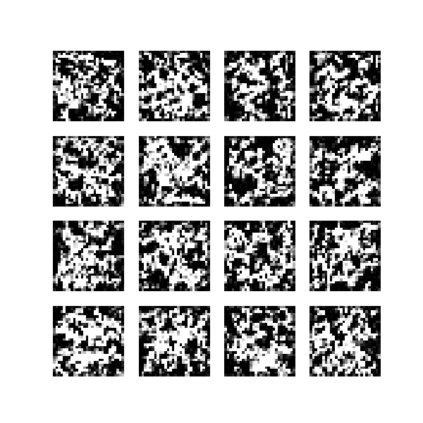
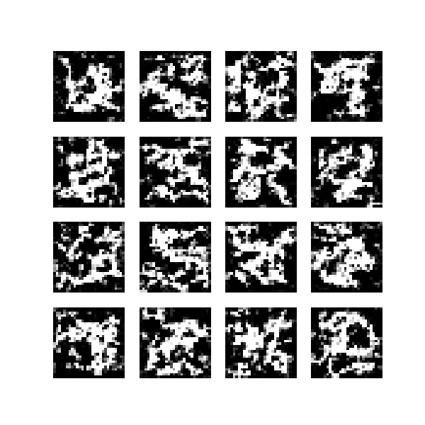
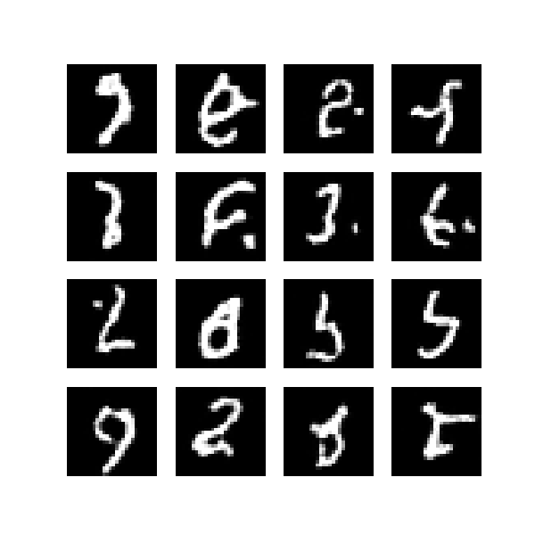

# TinyDiff – A Minimal, From-Scratch Diffusion Model

TinyDiff is a compact yet fully-featured implementation of **Denoising Diffusion Probabilistic Models (DDPMs)** developed entirely from scratch.
The goal of the project is clarity, reproducibility, and extensibility. TinyDiff is designed as a small research environment where new architectural ideas, noise schedules, and conditioning mechanisms can be explored with minimal friction.

The entire system — including the UNet, diffusion process, sampling logic, data pipeline, and training loop — is implemented manually to provide full transparency into how diffusion models work internally.

---

## Core Features

* Fully implemented DDPM pipeline
* Modular, extensible UNet with timestep embeddings and up/downsampling blocks
* Noise schedules
* Training and sampling scripts for reproducible experiments
* Experimental tracking to preserve model evolution over time

---

## Milestone 1: Baseline DDPM Progression

Milestone 1 documents the evolution of the simplest possible diffusion model into a stable baseline capable of generating clean MNIST-like digits. Three snapshots were captured during training as architectural improvements were introduced.

Below is a summary of how the model progressed, along with the corresponding sample images.

---

### Stage 1 — Linear Beta Schedule + Basic UNet

*The model begins to reverse noise but lacks any understanding of structure.*

At this early stage, the model has only a minimal UNet and a linear noise schedule. The generated samples are mostly noise; faint digit-like patterns occasionally emerge, but shapes are unstable and dominated by artifacts.

  

---

### Stage 2 — Added Timestep Embeddings

*The model learns temporal information, making the denoising process more coherent.*

By incorporating sinusoidal timestep embeddings, the model gains awareness of how much noise remains at each step of the reverse process.
This significantly stabilizes generation: digits begin to appear more clearly, though still noisy and incomplete.

  

---

### Stage 3 — Up/Downsampling UNet Blocks

*The model can now reason at multiple spatial scales, resulting in sharp and recognizable samples.*

Introducing downsampling and upsampling paths transforms the UNet into a hierarchical model that captures both global shapes and fine details.
This produces the first fully clean, coherent digits — the transition from noisy, unstable outputs to structured samples is visibly dramatic.

  

---

## Next Steps

Here’s a concise, minimal version of the “Next Steps” paragraph:

---

## Next Steps

The next milestone will extend TinyDiff to **text-to-image generation**, allowing the model to generate digits directly from natural language prompts (e.g., “a handwritten number three”). This involves integrating a small text encoder into the UNet and updating the sampling pipeline to accept prompt strings. The focus remains on keeping the model lightweight, fully interpretable, and runnable locally.

---

## Project Goals

TinyDiff aims to be a concise but instructive diffusion codebase suitable for:

* Learning and understanding the mechanics of diffusion models
* Rapid experimentation on small-scale architectures
* Demonstrating ML engineering skills and research-oriented design principles

---
